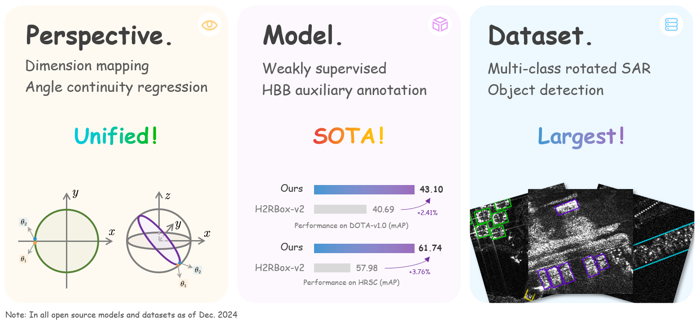
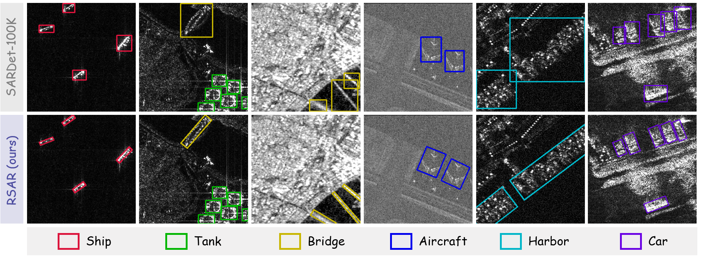
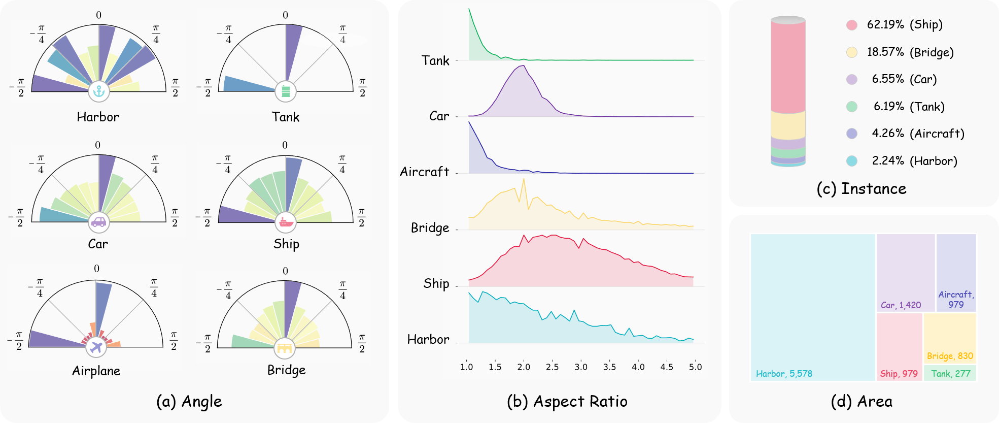

<p align="center">
  <h1 align="center">RSAR: Restricted State Angle Resolver and Rotated SAR Benchmark</h1>
  <p align="center">
      <a href='https://github.com/zhasion' style='text-decoration: none' >Xin Zhang</a><sup></sup>&emsp;
      <a href='https://yangxue0827.github.io/' style='text-decoration: none' >Xue Yang</a><sup></sup>&emsp;
      <a href='https://zcablii.github.io/' style='text-decoration: none' >Yuxuan Li</a><sup></sup>&emsp;
      <a href='https://scholar.google.com/citations?user=6CIDtZQAAAAJ&hl=zh-CN&oi=ao' style='text-decoration: none' >Jian Yang</a><sup></sup>&emsp;      
      <a href='https://mmcheng.net/cmm/' style='text-decoration: none' >Ming-Ming Cheng</a><sup></sup>&emsp;     
      <a href='https://implus.github.io/' style='text-decoration: none' >Xiang Li</a><sup>*</sup>&emsp;
      <h3 align='center'>CVPR 2025</h3>
      <div align="center">
      <a href='https://arxiv.org/abs/2501.04440'></a>
      <a href='https://github.com/zhasion/RSAR'></a>
      <a href='https://drive.google.com/file/d/1v-HXUSmwBQCtrq0MlTOkCaBQ_vbz5_qs/view?usp=sharing'></a>
      <a href='https://pan.baidu.com/s/1DVUNBuWrhJRg0H1qhwtfEQ?pwd=rsar'></a>
      <a href='https://zhuanlan.zhihu.com/p/16758735545'></a>
	  </div>
    <p align='center'>
        If you find our work helpful, please consider giving us a ⭐!
    </p>
   </p>
</p>


## ⭐️Highlights




## 📋Introduction

<h3 align='left'>
    Abstract
</h3>

<div>
    <span style='font-weight:bold'>Rotated object detection</span> has made significant progress in the optical remote sensing. However, advancements in the <span style='font-weight:bold'>Synthetic Aperture Radar (SAR)</span> field are laggard behind, primarily due to the absence of a large-scale dataset. Annotating such a dataset is inefficient and costly. A promising solution is to employ a weakly supervised model (e.g., trained with available horizontal boxes only) to generate pseudo-rotated boxes for reference before manual calibration. Unfortunately, the existing weakly supervised models exhibit limited accuracy in predicting the object's angle. Previous works attempt to enhance angle prediction by using angle resolvers that decouple angles into cosine and sine encodings. In this work, <span style="color:#ffc104; font-weight: bold">we first reevaluate these resolvers from a unified perspective of dimension mapping and expose that they share the same shortcomings</span>: these methods overlook the unit cycle constraint inherent in these encodings, easily leading to prediction biases. To address this issue, we propose the Unit Cycle Resolver, which incorporates a unit circle constraint loss to improve angle prediction accuracy. <span style='color:#9a6ebe; font-weight:bold'>Our approach can effectively improve the performance of existing state-of-the-art weakly supervised methods</span> and even surpasses fully supervised models on existing optical benchmarks (i.e., DOTA-v1.0 dataset). <span style='color:#4796d2; font-weight:bold'>With the aid of UCR, we further annotate and introduce RSAR, the largest multi-class rotated SAR object detection dataset to date</span>. Extensive experiments on both RSAR and optical datasets demonstrate that our UCR enhances angle prediction accuracy.
</div>


## ⚡RSAR Dataset



This dataset is build on [SARDet-100K](https://github.com/zcablii/SARDet_100K) and it contains `95,842` images, including `78,837` in the training set, `8,467` in the validation set, and `8,538` in the test set. Instance statistics for each category are shown in the table below

|   Category    | Train ins. | Val ins. | Test ins. |
| :-----------: | :--------: | :------: | :-------: |
|   Ship (SH)   |   92,950   |  10,492  |  10,700   |
| Aircraft (AI) |   6,880    |   449    |    494    |
|   Car (CA)    |   9,567    |  1,219   |   1,231   |
|   Tank (TA)   |   9,479    |  1,000   |    886    |
|  Bridge (BR)  |   27,512   |  3,300   |   3,272   |
|  Harbor (HA)  |   3,304    |   400    |    399    |
|   **Total**   |  149,692   |  16,860  |  16,982   |

The following figure provides a statistical analysis of the annotated instances for each category in the RSAR dataset




## 🛠️ Usage

### 1. Installation

Please refer to [mmrotate dev-1.x](https://github.com/open-mmlab/mmrotate/blob/dev-1.x) for more detailed instructions.

```sh
conda create --name mmrotate python=3.8 -y
conda activate mmrotate
conda install pytorch==1.13.1 torchvision==0.14.1 torchaudio==0.13.1 pytorch-cuda=11.6 -c pytorch -c nvidia
pip install -U openmim
mim install mmcv-full
mim install mmdet
git clone https://github.com/zhasion/RSAR
cd RSAR
pip install -v -e .
```

> Note: Install PyTorch please following [official instructions](https://pytorch.org/get-started/locally/).

### 2. Dataset Prepare

Download the `RSAR` dataset from the[](https://drive.google.com/file/d/1v-HXUSmwBQCtrq0MlTOkCaBQ_vbz5_qs/view?usp=sharing) or [](https://pan.baidu.com/s/1DVUNBuWrhJRg0H1qhwtfEQ?pwd=rsar) and extract the files to `$DATAROOT`. The directory structure should look like:

```
$DATAROOT
|-- train
|   |-- annfiles  # contains annotations :*.txt
|   `-- images    # contains sar images  :*.jpg *.bmp *.png
|-- val
|   |-- annfiles
|   `-- images
`-- test
    |-- annfiles
    `-- images
```

> Please refer to [data_preparation.md](tools/data/README.md) to prepare the other datasets (e.g. DOTAv-1.0, HRSC). Please note that the dataset needs to be sliced accordingly after downloading, and all experiments in this repository are based on a single-size setting.

### 3. Training

If you are using a single GPU, you can refer to the following commands:

```sh
python tools/train.py [your_config]
```

If you are using multiple GPUs, you can refer to the following commands:

```sh
sh tools/dist_train.sh [your_config] [available_GPU_num]
```

### 4. Evaluation

```sh
python tools/test.py [your_config]
```

> Please note that if you need to output results for multiple iou thresholds and the precision of the results, you need to modify the configuration accordingly.

### 5. Convert model

If you find the trained model very large, please refer to [publish_model.py](tools/model_converters/publish_model.py)

```sh
python tools/model_converters/publish_model.py [your_model.pth] [your_new_model.pth]
```


## 🚀Models and Results

### 1. Weakly supervised Model 

The weakly supervised model is based on H2RBox-v2 with our `UCR`. All Models utilize ResNet50 as the backbone and trained on **one GPU**. 

|  Dataset  | DM<sup>*</sup> | mAP  | Angle  | lr schd |  BS  | Config |      Download       |
| :-------: | :----: | :--: | :----: | :-----: | :--: | :----: | :-----------------: |
| DOTA-v1.0 |   2    | 42.65 | `le90` |  `1x`   |  2   | [config](configs/h2rbox_v2/h2rbox_v2-le90_r50_fpn-1x_dota_ucr_2d.py) | [ckpt](https://drive.google.com/file/d/1BWugNU-u3FezBdpTem5CYGT3TmIF1mvG/view?usp=drive_link) \| [log](https://drive.google.com/file/d/1X9b0J6Jfx680tWR8S-q40v5W_aiMXqqH/view?usp=drive_link) |
| DOTA-v1.0 |   3    | 43.10 | `le90` |  `1x`   |  2   | [config](configs/h2rbox_v2/h2rbox_v2-le90_r50_fpn-1x_dota_ucr_3d.py) | [ckpt](https://drive.google.com/file/d/1U7Ug5669i3nGwrdtogNpmxu-jqIPLYED/view?usp=sharing) \| [log](https://drive.google.com/file/d/1nqY_oFpm3paEhHwuvBeK2_LxYVh66rWv/view?usp=sharing) |
|   HRSC    |   2    | 60.00 | `le90` |  `6x`   |  2   | [config](configs/h2rbox_v2/h2rbox_v2-le90_r50_fpn-6x_hrsc_ucr_2d.py) | [ckpt](https://drive.google.com/file/d/1BESCnaTpAKyYnzzkrfu_xzzeljWrOxSE/view?usp=sharing) \| [log](https://drive.google.com/file/d/1zKmVHm9gi6vm3rEUf049QBhQ0Jl5GX0L/view?usp=sharing) |
|   HRSC    |   3    | 61.74 | `le90` |  `6x`   |  2   | [config](configs/h2rbox_v2/h2rbox_v2-le90_r50_fpn-6x_hrsc_ucr_3d.py) | [ckpt](https://drive.google.com/file/d/12BSgPDhhwDlY_YhkhsE78U7kAb_0ySTx/view?usp=sharing) \| [log](https://drive.google.com/file/d/1VOBRPt_oifytxphwqayTKU5OwUECt3FB/view?usp=sharing) |
|   RSAR    |   2    | 32.25 | `le90` |  `1x`   |  2   | [config](configs/h2rbox_v2/h2rbox_v2-le90_r50_fpn-1x_rsar_ucr_2d.py) | [ckpt](https://drive.google.com/file/d/1uNadAws7VtxMIRd348_B32KFpzsTmtfw/view?usp=sharing) \| [log](https://drive.google.com/file/d/1_jQGVJi06nHFmcjhJmvJ9uQSXlwMkcGA/view?usp=sharing) |
|   RSAR    |   3    | 32.64 | `le90` |  `1x`   |  2   | [config](configs/h2rbox_v2/h2rbox_v2-le90_r50_fpn-1x_rsar_ucr_3d.py) | [ckpt](https://drive.google.com/file/d/1xnBuCBbe5s2apKhf-Ptec5mXojDA49Pc/view?usp=sharing) \| [log](https://drive.google.com/file/d/1P6fkGpjGgr-Adq1sHbyJcLXKdrb3Rwkl/view?usp=sharing) |

\* denotes the dimension of mapping in `UCR`. 

> Note: It is normal for the reproduction accuracy of the model to deviate slightly from the reported accuracy, but it should all be substantially improved from the baseline model. 


### 2. Fully supervised Model (base on RSAR)

Various detectors trained on `RSAR`. All models are trained on **4 GPUs**. 

|      Backbone      |        Model        |  mAP  | Angle  |  lr schd  |  BS  | Config | Download |
| :----------------: | :-----------------: | :---: | :----: | :-------: | :--: | :----: | :---------------: |
| ResNet50 (800,800) |  Rotated-RetinaNet  | 27.65 | `le90` |   `1x`    |  2   | [config](configs/rotated_retinanet/rotated-retinanet-rbox-le90_r50_fpn_1x_rsar.py) | [ckpt](https://drive.google.com/file/d/1rL7oAZQPpYuiiGow63uj5Ej4CJuzOv1d/view?usp=sharing) \| [log](https://drive.google.com/file/d/1yWA7Mlum_4b6KqDc7NX4yiGqqE8uDxFY/view?usp=sharing) |
| ResNet50 (800,800) |      R3Det       | 30.50 | `le90` |   `1x`    |  2   | [config](configs/r3det/r3det-le90_r50_fpn_1x_rsar.py) | [ckpt](https://drive.google.com/file/d/17oGLjtdOg6tlpqcA7Li1-BArBpAPeJ_9/view?usp=sharing) \| [log](https://drive.google.com/file/d/10cgIxVkq-KsrmUVyq0bDrQLxUWxp8_NO/view?usp=sharing) |
| ResNet50 (800,800) |      S2ANet      | 33.11 | `le90` |   `1x`    |  2   | [config](configs/s2anet/s2anet-le90_r50_fpn_1x_rsar.py) | [ckpt](https://drive.google.com/file/d/1xju1PGARP8h767Xr0yNpxNlan8E8hezJ/view?usp=sharing) \| [log](https://drive.google.com/file/d/1Nr8QkDlrMmT7rJNlFIDfSDksZoAcRBX2/view?usp=sharing) |
| ResNet50 (800,800) |    Rotated-FCOS     | 34.22 | `le90` |   `1x`    |  2   | [config](configs/rotated_fcos/rotated-fcos-le90_r50_fpn_1x_rsar.py) | [ckpt](https://drive.google.com/file/d/13yswgvxNclZboOVy2x5pf7zdBWn5Q3yA/view?usp=sharing) \| [log](https://drive.google.com/file/d/1Q53FL9WVWRxNuQ6_VqxvohHHVpZMmHxE/view?usp=sharing) |
| ResNet50 (800,800) | Rotated-Faster RCNN | 30.46 | `le90` |   `1x`    |  2   | [config](configs/rotated_faster_rcnn/rotated-faster-rcnn-le90_r50_fpn_1x_rsar.py) | [ckpt](https://drive.google.com/file/d/1ynmuD1Szq5KnOWlX86a-SBIe09yiXcbj/view?usp=sharing) \| [log](https://drive.google.com/file/d/1TxsS-pavIb8MDLxSRPpcGwV3WwSGxfeq/view?usp=sharing) |
| ResNet50 (800,800) |       O-RCNN        | 33.62 | `le90` |   `1x`    |  2   | [config](configs/oriented_rcnn/oriented-rcnn-le90_r50_fpn_1x_rsar.py) | [ckpt](https://drive.google.com/file/d/1xSUr6QOj8nyoQSmO2pmIqgvZEofwcQ7u/view?usp=sharing) \| [log](https://drive.google.com/file/d/1V3JroJK0B1_R1n2HguxBxYLvDkRKQCMV/view?usp=sharing) |
| ReResNet50 (800,800) |        ReDet        | 34.30 | `le90` |   `1x`    |  2   | [config](configs/redet/redet-le90_re50_refpn_1x_rsar.py) | [ckpt](https://drive.google.com/file/d/15z4WVeq4ChYoRXwvh_Nry4Ok9ozxytvB/view?usp=sharing) \| [log](https://drive.google.com/file/d/1P73YiWGWsPNSgu06kDqyB0cuW8nOe6oT/view?usp=sharing) |
| ResNet50 (800,800) |   RoI-Transformer   | 35.02 | `le90` |   `1x`    |  2   | [config](configs/roi_trans/roi-trans-le90_r50_fpn_1x_rsar.py) | [ckpt](https://drive.google.com/file/d/1hmjnirDacJSqhTKolpKcnDeJxE5agU4U/view?usp=sharing) \| [log](https://drive.google.com/file/d/1NP-9wXuZVJymnpr_wmvRTQEyUpUPY9pM/view?usp=sharing) |
| ResNet50 (800,800) |   Deformable DETR   | 19.63 | `le90` | `1x`<sup>*</sup> |  2   | [config]() | [ckpt](https://drive.google.com/file/d/10utd41U9R1UQAV1n4tJRkuNKRVDsjvPu/view?usp=sharing) \| [log](https://drive.google.com/file/d/1W5RWubZZNRwOEFcxw5bkfiq26Luxmf4R/view?usp=sharing) |
| ResNet50 (800,800) |      ARS-DETR       | 31.56 | `le90` | `1x`<sup>*</sup> |  2   | [config]() | [ckpt](https://drive.google.com/file/d/1wKJZXn9Qb7RFN-B9pXQ_Jrx31_VGW4wd/view?usp=sharing) \| [log](https://drive.google.com/file/d/1NwJBLcnBCrRQupIbk9ixGtfhUPwb9EwL/view?usp=sharing) |

\* denotes a special setting in the official repo (e.g. trained 36 epochs in practice), details see [STAR-MMRotate](https://github.com/yangxue0827/STAR-MMRotate).


## 📘Citation

If you find our paper or benchmark helpful for your research, please consider citing our paper and giving this repo a star ⭐. Thank you very much!

```bibtex
@article{zhang2025rsar,
  title={RSAR: Restricted State Angle Resolver and Rotated SAR Benchmark},
  author={Zhang, Xin and Yang, Xue and Li, Yuxuan and Yang, Jian and Cheng, Ming-Ming and Li, Xiang},
  journal={arXiv preprint arXiv:2501.04440},
  year={2025}
}

@inproceedings{li2024sardet,
  title={Sardet-100k: Towards open-source benchmark and toolkit for large-scale sar object detection},
  author={Li, Yuxuan and Li, Xiang and Li, Weijie and Hou, Qibin and Liu, Li and Cheng, Ming-Ming and Yang, Jian},
  booktitle={The Thirty-eighth Annual Conference on Neural Information Processing Systems (NeurIPS)},
  year={2024},
}
```

## Contact

If you have any question, please feel free to contact us via `zhasion@mail.nankai.edu.cn` or Github issues. 

## License

Licensed under a [Creative Commons Attribution-NonCommercial 4.0 International](https://creativecommons.org/licenses/by-nc/4.0/) for Non-commercial use only. Any commercial use should get formal permission first.

